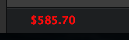

atom-bitcoin
============

Watch the latest selling price for bitcoin while you code!

To install

`` cd /Users/your_username/.atom/packages ``

`` git clone git@github.com:ahmetabdi/atom-bitcoin.git ``

then restart atom

Update interval fixed to 5 seconds

Has colour updates to show increase/decrease in price in USD

This uses the [BitcoinAverage API](https://bitcoinaverage.com/api.htm)

It's an open source project designed to provide weighted average bitcoin price calculation. It utilises all exchanges where price and volume data is available.
